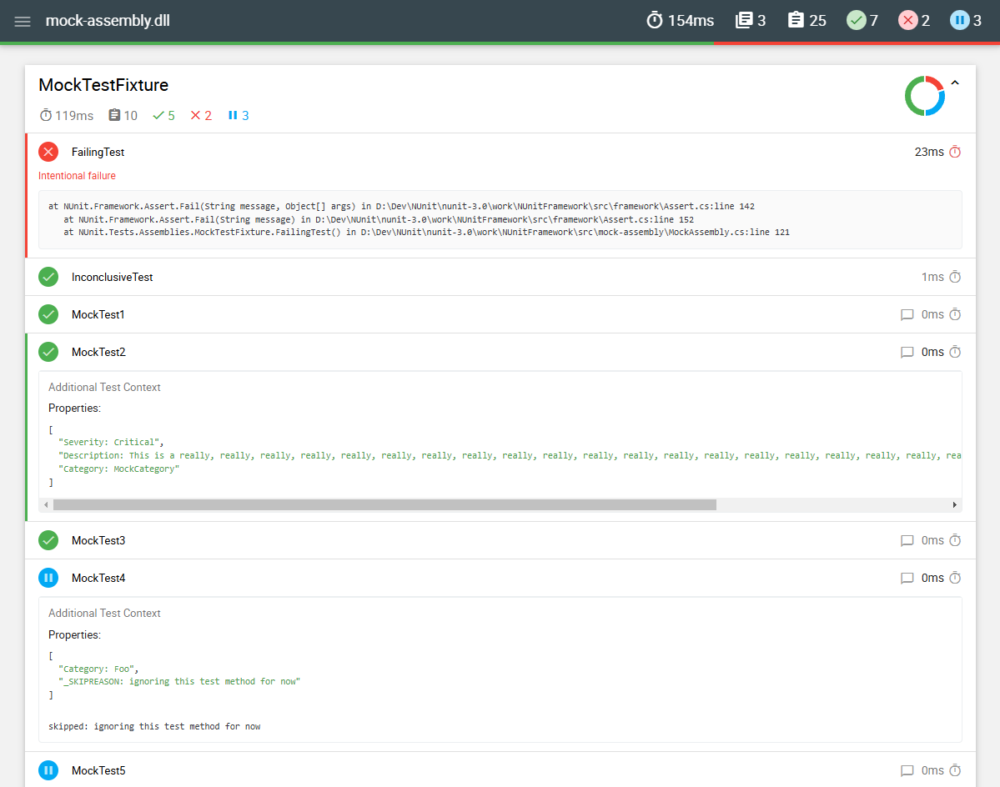

## Test report files to HTML and JUnit converter

[![Actions Status][github-img]][github-url]
[![Codacy Badge][codacy-img]][codacy-url]
[![Git Issues][issues-img]][issues-url]
[![Closed Issues][closed-issues-img]][closed-issues-url]

### Overview

- Convert your XML/TRX/JSON test report files to Mochawesome JSON/HTML for easy viewing and troubleshooting.
- Convert test report files to JUnit format.
- Convert JUnit to HTML using Mochawesome.

### Supported report formats

- JUnit/xUnit XML Format  
- NUnit v3+ XML Format  
- xUnit.net v2+ XML Format  
- MSTest TRX Format (this is default `dotnet test` report output)  
- CTRF JSON  

### What is Mochawesome

Mochawesome is a custom test reporter originally designed for Mocha Javascript testing framework.
It features a clean modern interface allowing users to easily view and navigate test runs.  
https://github.com/adamgruber/mochawesome



### List of supported features

- Simple, clean, and modern design
- Per suite charts (via ChartJS)
- Stack trace for failed tests
- Support for displaying context information
- Filters to display only the tests you want 
- Responsive and mobile-friendly
- Offline viewing

### Features not supported by converter

- Support for test and suite nesting
- Displays before and after hooks
- Review test code inline
- Attachments

### Conversion process

 - All test reports except CTRF are first converted to JUnit format using [junit-converter](https://github.com/agracio/junit-converter).
 - Set `junit` option to `true` to get JUnit conversion results. Not supported for CTRF resports.
 - If you only require JUnit conversion, use [junit-converter](https://github.com/agracio/junit-converter).

### JUnit to Mochawesome conversion

- Converts &lt;skipped&gt; test messages to Mochawesome test context values.
- Converts &lt;properties&gt;, &lt;system-out&gt; and &lt;system-err&gt; to Mochawesome context values.
- Converts &lt;failure&gt; and &lt;error&gt; elements to Mochawesome error stack.
- Tests suites without any tests are excluded from Mochawesome and JUnit.

### CTRF to Mochawesome conversion

- Converts `parameters`, `steps`, `stdout` and `stderr` to Mochawesome context values.
- Converts `message` and `trace` elements to Mochawesome error stack.

### Conversion process to JUnit

- **Full conversion process is described in [junit-converter](https://github.com/agracio/junit-converter)**

### Usage

```bash
npm i --save-dev mochawesome-converter
```

```js
const convert = require('mochawesome-converter');

let options = {
    testFile: 'mytesfiles/nunit.xml',
    testType: 'nunit',
    junit: true
}

convert(options).then(() => console.log(`Mochawesome report created`));
```

### CLI usage

```bash
npm i -g mochawesome-converter
```

```bash
mochawesome-converter --testFile mytests/nunit.xml --testType nunit --junit true --html true
```

### Options

| Option                    | Type    | Default                          | Description                                       |
|:--------------------------|:--------|:---------------------------------|:--------------------------------------------------|
| `testFile` **(required)** | string  |                                  | Path to test file for conversion                  |
| `testType` **(required)** | string  |                                  | [Test report type](#supported-testtype-options)   |
| `reportDir`               | string  | ./report                         | Converted report output path                      |
| `reportFile`              | string  | `testFile.name`-mochawesome.json | Mochawesome JSON report name                      |
| `junit`                   | boolean | false                            | Create JUnit report? (Not supported for CTRF)                              |
| `junitReportFile`         | string  | `testFile.name`-junit.xml        | JUnit report file name                            |
| `html`                    | boolean | true                             | Create Mochawesome HTML?                          |
| `htmlReportFile`          | string  | `testFile.name`-mochawesome.html | Mochawesome HTML file name                        |
| `htmlReportTitle`         | string  | `testFile`                       | Mochawesome HTML report title                     |
| `splitByClassname`        | boolean | false                            | Split into multiple test suites by test classname |
| `skippedAsPending`        | boolean | true                             | Show skipped tests as pending in Mochawesome      |
| `switchClassnameAndName`  | boolean | false                            | Switch test case classname and name               |
| `charts`                  | boolean | false                            | Display Suite charts                              |

- `testFile` - relative or absolute path to input test file.
- `testType` - type of test report, not case-sensitive.
- `reportDir` - will be created if path does not exist.  
  
- `splitByClassname` - If true, splits test cases into multiple test suites by classname.  
  This is useful for test runners that generate tests under a single test suite such as `dotnet test` when using JUnit loggers.  
  TRX report files are always split by classname, so this option is ignored for TRX files.  
  Not applicable to CTRF reports.  
    
- `skippedAsPending` - Mocha always reports skipped tests as pending and this is default behaviour of converter.  
  Set to `false` to display tests as skipped.  
  Not applicable to CTRF - it supports both skipped and pending.  
    
- `switchClassnameAndName` - Switches classname and name attributes of testcase if your test naming data is generated in reverse order.  
  Not applicable to CTRF reports.  
  
- `charts` - Display Suite charts (see screenshot).  

#### Supported `testType` options.

| `testType` | File Type                  |
|:-----------|:---------------------------|
| JUnit      | JUnit/xUnit XML            |
| NUnit      | NUnit v3+ XML              |
| xUnit      | xUnit.net v2+ XML          |
| TRX        | MSTest TRX (`dotnet test`) |
| CTRF       | CTRF JSON                  |


[issues-img]: https://img.shields.io/github/issues-raw/agracio/mochawesome-converter.svg?style=flat-square
[issues-url]: https://github.com/agracio/mochawesome-converter/issues
[closed-issues-img]: https://img.shields.io/github/issues-closed-raw/agracio/mochawesome-converter.svg?style=flat-square&color=brightgreen
[closed-issues-url]: https://github.com/agracio/mochawesome-converter/issues?q=is%3Aissue+is%3Aclosed

[codacy-img]: https://app.codacy.com/project/badge/Grade/1b8b8f9fdbce4267bf779197141657a2
[codacy-url]: https://app.codacy.com/gh/agracio/mochawesome-converter/dashboard?utm_source=gh&utm_medium=referral&utm_content=&utm_campaign=Badge_grade

[github-img]: https://github.com/agracio/mochawesome-converter/workflows/Test/badge.svg
[github-url]: https://github.com/agracio/edge-js/mochawesome-converter/workflows/main.yml

