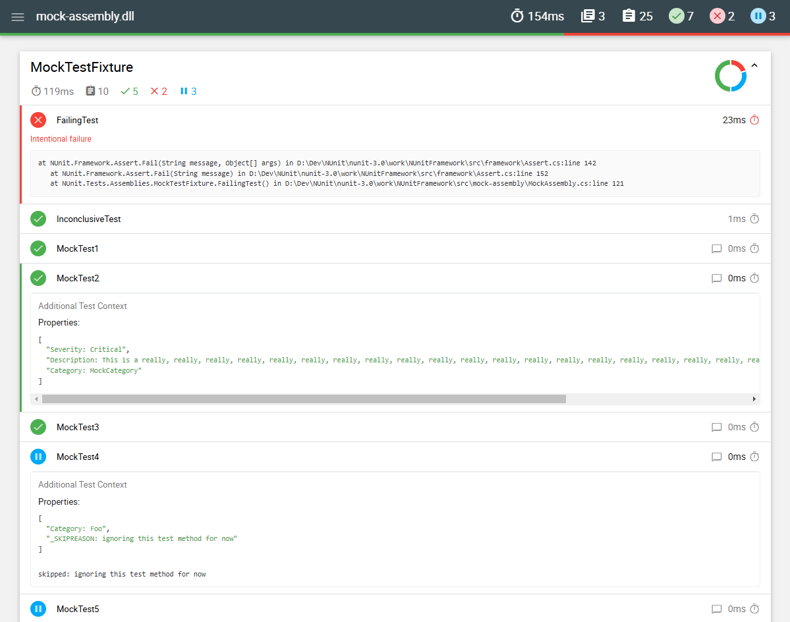

## Test report files to Mochawesome and JUnit converter

### Overview

- Convert your XML/TRX test report files to Mochawesome for easy viewing and troubleshooting.
- Convert test report files to JUnit format.

### Supported report formats

- JUnit XML Format  
- NUnit 3.0+ XML Format  
- xUnit.net v2+ XML Format  
- Visual Studio TRX Format  

### What is Mochawesome

Mochawesome is a custom test reporter originally designed for Mocha Javascript testing framework.
It features a clean modern interface allowing users to easily view and navigate test runs.  
https://github.com/adamgruber/mochawesome



### List of supported features

- Simple, clean, and modern design
- Per suite charts (via ChartJS)
- Stack trace for failed tests
- Support for displaying context information
- Filters to display only the tests you want 
- Responsive and mobile-friendly
- Offline viewing

### Features not supported by converter

- Support for test and suite nesting
- Displays before and after hooks
- Review test code inline

### Conversion process

 - All test reports except JUnit are first converted to JUnit format using XSLT.
 - TRX files undergo additional processing to enhance JUnit output.
 - Set `junit` option to `true` to get JUnit conversion results.

### All test types

- Converts &lt;skipped&gt; test messages to Mochawesome test context values.
- Converts &lt;properties&gt;, &lt;system-out&gt; and &lt;system-err&gt; to Mochawesome context values.
- Converts &lt;failure&gt; and &lt;error&gt; elements to Mochawesome error stack.
- Test suites are displayed in alphabetical order by `file` and `classname` attributes.
- Tests suites without any tests are excluded from Mochawesome and JUnit.
- Attachments are not supported.

### JUnit 

- Converts `testcase` **&lt;properties&gt;**, **&lt;system-out&gt;** and **&lt;system-err&gt;** elements to Mochawesome test context.
- Nested test suites currently not supported.

### NUnit

- NUnit XML version 3 and higher is supported.
- Converts `test-case` **&lt;properties&gt;** elements to JUnit **&lt;properties&gt;**.
- Converts `test-case` **&lt;output&gt;** elements to JUnit **&lt;system-out&gt;**.
- Nested `test-suite` elements are flattened and appear in `classname` order.

### xUnit  

- xUnit.net v2+ XML is supported.
- Converts `test` **&lt;traits&gt;** elements to  to JUnit **&lt;properties&gt;**.
- Converts `test` **&lt;reason&gt;** elements to JUnit **&lt;skipped&gt;**.
- Supports single **&lt;assembly&gt;** per file, if multiple assemblies are present only first will be converted.

### Visual Studio TRX

- Converts `Output/ErrorInfo/Message` to JUnit **&lt;failure&gt;** message.
- Converts `Output/ErrorInfo/StackTrace` to JUnit **&lt;failure&gt;** stack trace.
- Converts `Output/StdErr` to JUnit **&lt;system-err&gt;**.
- Converts `Output/StdOut` to JUnit **&lt;system-out&gt;**.
- Test suites are split into multiple **&lt;testsuite&gt;** elements by test classname.
- Tests are ordered by name.
- Test suit times are not 100% accurate - displayed as a sum() of all test times. 

### Usage

```bash
npm i mochawesome-converter
```

```js
const convert = require('mochawesome-converter');

let options = {
    testFile: 'mytesfiles/nunit.xml',
    testType: 'nunit',
    junit: true
}

convert(options).then(() => console.log(`Report created: ${options.reportDir}/${options.reportFilename}`));
```

### Options

| Option                    | Type    | Default                   | Description                           |
|:--------------------------|:--------|:--------------------------|:--------------------------------------|
| `testFile` **(required)** | string  |                           | Path to test file for conversion      |
| `testType` **(required)** | string  |                           | Test report type                      |
| `reportDir`               | string  | ./report                  | Converted report output path          |
| `reportFilename`          | string  | mochawesome.json          | Mochawesome report name               |
| `junit`                   | boolean | false                     | Create JUnit report?                  |
| `junitReportFilename`     | string  | `testFile.name`-junit.xml | JUnit report file name                |
| `html`                    | boolean | false                     | Create Mochawesome HTML?              |
| `htmlReportFilename`      | string  | mochawesome.html          | Mochawesome HTML file name            |
| `skippedAsPending`        | boolean | true                      | Show skipped tests as pending in HTML |

- `testFile` - relative or absolute path to input test file.
- `testType` - type of test report, not case-sensitive.
- `reportDir` - will be created if path does not exist.
- `skippedAsPending` - Mocha always reports skipped tests as pending and this is default behaviour of converter. 
  Set to `false` to display tests as skipped.

#### Supported `testType` options.

| `testType` | File Type         |
|:-----------|:------------------|
| JUnit      | JUnit             |
| NUnit      | NUnit 3+ XML      |
| xUnit      | xUnit.net v2+ XML |
| TRX        | Visual Studio TRX |


## Implementation and documentation in progress...


